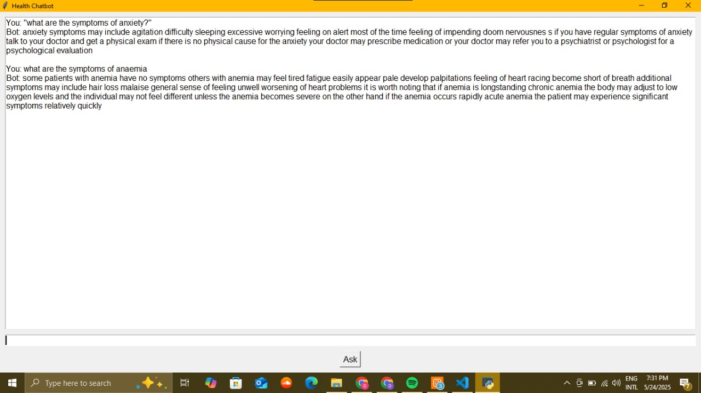

# 🩺 Health Chatbot (NLP + Sentence Transformers)

This project is a Python-based health chatbot built using Natural Language Processing (NLP) techniques. It answers user health-related questions using sentence similarity powered by **Sentence Transformers** (MiniLM). It includes a simple GUI made with Tkinter.

🚀 Features

- Uses `sentence-transformers` to match user queries with known health-related questions
- Answers sourced from a structured CSV dataset
- GUI built with Tkinter for local interaction
- Supports flexible health topics like symptoms, conditions, and general advice

🧠 How It Works

- Loads a dataset of health questions & answers
- Converts all questions to vector embeddings using a transformer model (`all-MiniLM-L6-v2`)
- Accepts user queries, encodes them, and finds the closest match
- Displays the corresponding answer from the dataset

 🖼 GUI Preview

 <!-- Optional: Add a screenshot if available -->

📂 Dataset
The dataset is too large to host on GitHub directly.  
You can download it from Google Drive here:

📥 [Download Dataset (CSV)](https://drive.google.com/file/d/1uSZ5pwfLXr6ta1P7a8YnxEG6e-pWQ8H5/view?usp=drive_link)
